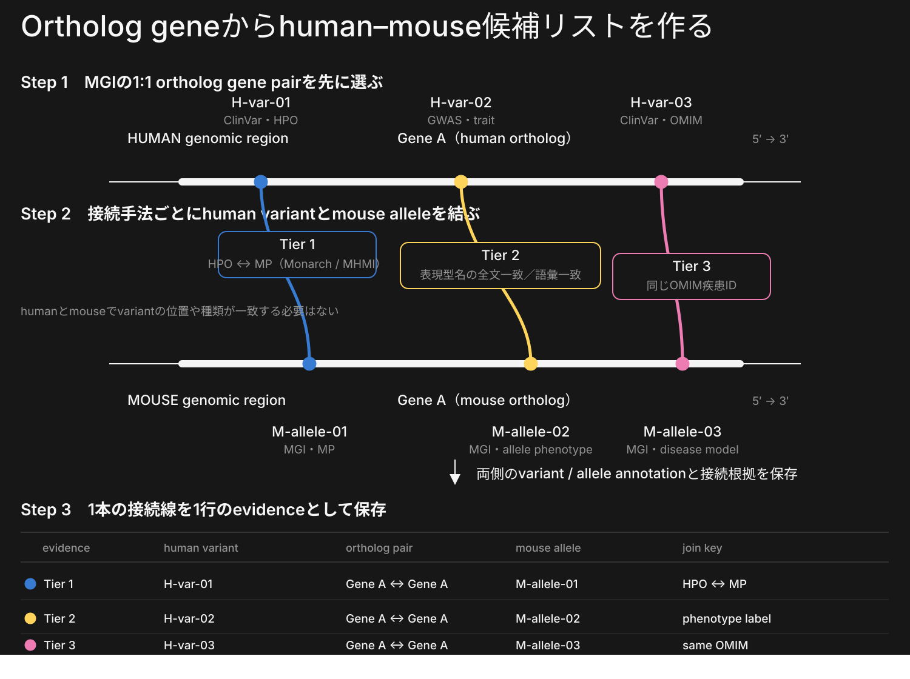
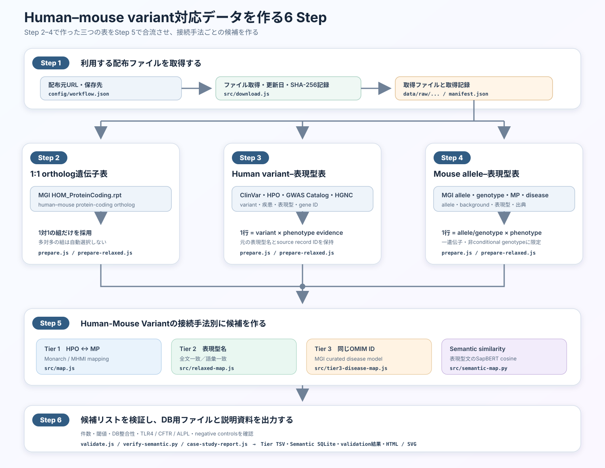

# Human–mouse variant correspondence: Methods and biological case studies

**利用したデータ:** 配布ファイル取得 2026-09-11、Semantic similarityの計算 2026-09-24  
**実装:** `2026/` rebuild version 2.0.0  
**目的:** human variantとmouse alleleを「同じ座標・同じアミノ酸置換」とみなすのではなく、1:1 ortholog geneを共通の足場とし、表現型・疾患モデル・文章類似度という独立した接続根拠をDB化する。

English version: [`METHODS_AND_CASE_STUDIES_EN.md`](METHODS_AND_CASE_STUDIES_EN.md)

## 1. 設計の要点

このデータの基本単位は、次の二層です。

1. **variant pair:** human gene + human variantと、mouse ortholog gene + mouse allele/genotypeの組。
2. **connection evidence:** そのpairを結んだ経路、両側の表現型、ontology predicateまたは共有疾患ID、score/class、原典、review flag。

一つのpairを一つのTierだけに割り当てません。同じpairがHPO–MP、表現型名、共通OMIM、semantic similarityの複数経路で支持される場合は、根拠を別行で保持します。これにより、検索時にはpairを一度だけ表示し、根拠確認時には各経路と入力データまで展開できます。



編集可能な図: [`output/tier_matching_strategy_ja.svg`](output/tier_matching_strategy_ja.svg)。以前の全体構造図[`output/methods_data_linkage.svg`](output/methods_data_linkage.svg)も残しています。

## 2. 利用したデータセット

`src/download.js`は、配布元から取得した各データファイルについて、URL、配布元が示す更新日時または配布版名、実際の取得日時、ファイル容量、SHA-256を`data/raw/manifest.json`へ保存します。SHA-256はファイル内容から計算する識別値で、次回取得したファイルが1 byteでも変わったかを判定するために使います。以下の表では先頭12桁だけを示し、完全な値とURLは[`DATA_VERSIONS.md`](DATA_VERSIONS.md)に記録しています。

| データセット | 使用ファイル | この解析で利用する情報 | 配布元の更新日・版 | 取得日時 (UTC) | SHA-256先頭 |
| --- | --- | --- | --- | --- | --- |
| ClinVar GRCh38 VCF | `data/raw/clinvar/clinvar.vcf.gz` | rsID、正確なGRCh38位置、REF/ALT、condition、clinical significance | 2026-09-06 16:25:09 | 2026-09-11 05:06:43 | `8cff3c5fb9ba` |
| HPO disease annotations | `data/raw/hpo/phenotype.hpoa` | disease IDからHPO phenotypeへ接続 | 2026-09-02 21:12:10 | 2026-09-11 05:06:46 | `e89aa39c8f97` |
| Monarch UPheno cross-species SSSOM | `data/raw/monarch/upheno-cross-species.sssom.tsv` | HPO–MP ontology mapping | 2026-09-09 14:51:58 | 2026-09-11 05:06:49 | `133b2ac088b2` |
| MHMI MGI mapping SSSOM | `data/raw/mhmi/mp_hp_mgi_all.sssom.tsv` | MGI-curated HPO–MP mapping | not reported | 2026-09-11 05:06:49 | `6b23131d80d5` |
| MGI GenePheno | `data/raw/mgi/MGI_GenePheno.rpt` | mouse genotype–MP evidence | 2026-09-07 12:01:12 | 2026-09-11 05:06:55 | `8defadf48934` |
| MGI HOM_ProteinCoding | `data/raw/mgi/HOM_ProteinCoding.rpt` | human–mouse 1:1 protein-coding ortholog | 2026-09-07 12:00:35 | 2026-09-11 05:06:57 | `14b81c2c8c65` |
| GWAS Catalog v1.0.2 | `data/raw/gwas/gwas_catalog_associations_v1.0.2.zip` | genome-wide significant human variant–trait evidence | `e116_r2026-09-04` | 2026-09-11 17:46:50 | `64f9f7c47daa` |
| MGI PhenotypicAllele | `data/raw/mgi/MGI_PhenotypicAllele.rpt` | allele名、型、原著、synonym | 2026-09-07 12:01:57 | 2026-09-11 17:42:44 | `3fd8b25665b1` |
| MGI MP vocabulary | `data/raw/mgi/VOC_MammalianPhenotype.rpt` | MP labelとdefinition | 2026-09-07 12:02:20 | 2026-09-11 17:42:47 | `2fd454098d42` |
| MGI Geno_DiseaseDO | `data/raw/mgi/MGI_Geno_DiseaseDO.rpt` | genotype–MPとcurated disease model | 2026-09-07 12:01:13 | 2026-09-11 17:42:50 | `c4e5e3a05c68` |
| HGNC complete set | `data/raw/hgnc/hgnc_complete_set.txt` | GWAS Ensembl gene IDから承認済みhuman geneへ変換 | 2026-09-11 13:36:41 | 2026-09-11 17:46:57 | `9e07bb49393c` |

## 3. Semantic similarity: 表現型文をSapBERTで比較する

入力はvariant座標ではなく、human側とmouse側の表現型を表す文章です。Human側は`human_variant_phenotypes.tsv.gz`の`phenotype_label`（ClinVar condition名または有意なGWAS trait名）、mouse側は`mouse_variant_phenotypes.tsv.gz`の`phenotype_label`（MGI MP label、allele名、またはdisease label）を使います。同じMGI 1:1 ortholog gene pairに属するhuman文とmouse文だけを比較します。

SapBERTで各文をベクトルへ変換し、cosine similarityを計算します。出力行にはhuman文、mouse文、score、class A–D、遺伝子ペア、両側のvariant/allele annotation、方向衝突・否定のreview flagを保存します。SapBERTはvariantの同等性を直接判定するモデルではありません。

| 項目 | この解析での設定 |
| --- | --- |
| モデル | [SapBERT](https://aclanthology.org/2021.naacl-main.334/) / `cambridgeltl/SapBERT-from-PubMedBERT-fulltext` |
| Human側のquery | ClinVar condition名または`P <= 5×10^-8`のGWAS trait名 |
| Mouse側の比較対象 | MGI MP label、allele名、disease label |
| 比較範囲 | 同じMGI 1:1 ortholog gene pair内だけ |
| 文章の表現 | pooler前CLS、768次元、最大128 token。実データの最長入力68 token、truncation 0件 |
| class | A ≥ 0.8、B = 0.7–<0.8、C = 0.5–<0.7、D < 0.5。Dは保存するが通常検索から除外 |
| 出力 | `phenotype_pairs_class_A/B/C/D.tsv.gz`、variant/allele annotation、`correspondence.sqlite` |
| 使用モデルファイル | revision `090663c3…51a4d`、model weights SHA-256 `a4696930…25614`。詳細は[`data/models/sapbert/manifest.json`](data/models/sapbert/manifest.json) |

## 4. データを作る6 Step

ここでいう「表記と列を揃える」は、取得したファイルを上書きすることではありません。配布元から取得したファイルは`data/raw/`にそのまま保存し、解析用の別ファイルを`data/processed/`へ作ります。具体的には、`MIM:123456`を`OMIM:123456`へ、ontology URLを`HP:...`または`MP:...`へ揃え、human/mouseのgene ID、variant/allele ID、表現型、出典を決まった列へ分けます。元の表現型名とsource record IDは残します。ClinVar VCFの座標とREF/ALTをこの工程で別の座標へ変換することはありません。



編集可能な図: [`output/data_generation_workflow_ja.svg`](output/data_generation_workflow_ja.svg)

Step 2–4はStep 1で取得したファイルから並行して三つの表を作り、Step 5で合流します。

- **Step 1:** 配布ファイルを取得し、更新日、取得日、容量、SHA-256を記録します。
- **Step 2:** Human–mouse比較を、MGIが1:1 orthologとして示す遺伝子ペア内に限定します。遺伝子を評価する新しい生物学的指標は作らず、MGIの情報を比較範囲として利用します。[MGI HOM_ProteinCoding.rpt](https://www.informatics.jax.org/downloads/reports/index.html)は1:1 human–mouse protein-coding orthologを直接提供します。別の選択肢である[Ensembl Compara](https://www.ensembl.org/info/docs/compara/homology_method.html)はgene treeから1:1、1対多、多対多を推定しますが、本解析では組合せを一意にするためMGI 1:1だけを使います。
- **Step 3:** Human側を1行 = 1 variant × 1 phenotype evidenceにします。ClinVar condition–HPOは同じ疾患IDを要求し、GWASは`P <= 5×10^-8`かつdirect `SNP_GENE_IDS`だけを使います。
- **Step 4:** Mouse側を1行 = 1 allele/genotype × 1 phenotype evidenceにします。一遺伝子・非conditional genotypeだけを使い、allele ID、MP ID、background、PubMed IDを残します。
- **Step 5:** Step 2の遺伝子表、Step 3のhuman表、Step 4のmouse表を結合し、Tier 1、Tier 2、Tier 3、Semantic similarityを別々に作ります。
- **Step 6:** 件数、class境界、DB整合性、TLR4/CFTR/ALPL、negative controlsを検査し、TSV、SQLite、検証結果、HTML/SVGを出力します。

### Humanデータセット上の注意点

- ClinVar condition IDとHPO disease IDが同じ場合だけ結びます。HPOはaspect `P`のみを使い、`NOT` annotationを除外します。
- 遺伝子が同じという理由だけで、その遺伝子の全variantへHPOを割り当てません。
- GWASは`P <= 5×10^-8`を満たし、`SNP_GENE_IDS`に直接記載されたgeneだけを使います。nearest gene名だけの割当は使いません。
- 個別例だけの手動文献表現型はproduction inputへ追加しません。

### Mouseデータセット上の注意点

複数遺伝子を含むgenotypeとconditional genotypeを除外します。Tier 3はMGIがcurateしたdisease modelだけを使い、似た疾患名からOMIM IDを推定しません。

### データ生成スクリプト

| スクリプト | 機能 | 主な出力 |
| --- | --- | --- |
| `src/download.js` | 配布ファイル取得と取得記録 | `data/raw/...`、`manifest.json` |
| `src/prepare.js` | ortholog表、ClinVar–HPO表、MGI allele–MP表を作成 | `ortholog_mapping.tsv`、`human_variant_hpo.tsv.gz`、`mouse_allele_mp.tsv` |
| `src/prepare-relaxed.js` | Human/mouse表現型表とID追加済みortholog表を作成 | `human_variant_phenotypes.tsv.gz`、`mouse_variant_phenotypes.tsv.gz` |
| `src/map.js` | Tier 1作成 | `tier1_monarch_phenotype.tsv.gz` |
| `src/relaxed-map.js` | Tier 2作成 | `tier2_ortholog_phenotype.tsv.gz` |
| `src/tier3-disease-map.js` | Tier 3作成 | `tier3_disease_model.tsv.gz` |
| `src/semantic-map.py` | 表現型文のSapBERT比較 | class A–D TSV、SQLite |
| `src/validate.js` | Tier件数・症例・negative control検査 | `tier_validation_results.tsv` |
| `src/verify-semantic.py` | class境界・DB・view検査 | `semantic/verification.json` |
| `src/case-study-report.js` | 3症例の結果集計 | `semantic/case_study_summary.tsv` |

## 5. Human-Mouse Variantの接続手法別の分類

Tier番号は検索戦略の名称であり、普遍的な信頼度順位ではありません。

| 分類 | Human側 | Mouse側 | 何が一致したとき結ぶか | 行数 |
| --- | --- | --- | --- | ---: |
| Tier 1 | ClinVar conditionから得たHPO | MGI allele/genotypeに付くMP | Monarch UPhenoまたはMHMIがHPO–MP対応を示す | 1,089,740 |
| Tier 2 | ClinVar condition名またはGWAS trait名 | MGI MP labelまたはallele名 | B: 変換後の全文一致、C: 一般語を除いた語彙一致 | 76,619 |
| Tier 3 | ClinVar conditionのOMIM ID | MGI curated disease modelのOMIM ID | OMIM IDが同じ | 331,245 |
| Semantic similarity | ClinVar/GWASの表現型文 | MGIの表現型文 | SapBERT cosine class A–D | A 1,702; B 4,412; C 66,367; D 2,836,628 |

Tier 1ではSSSOMのpredicate、mapping confidence、justification、mapping date、sourceを保持します。採用predicateは`skos:exactMatch`、`closeMatch`、`broadMatch`、`narrowMatch`、confidenceは0.8以上です。

Tier 2のsupport Bは、表現型名を小文字化し、記号を空白へ置換し、`LPS`/`endotoxin`などコードで定義した少数の別名を置換した後に、文字列全体が一致する場合です。support Cは、一般語を除いた後に最低2 tokenを共有し、Jaccard 0.6以上となる場合です。旧support Aは手動文献表現型に依存していたため廃止しました。

Tier 3はOMIM IDの完全一致だけを採用します。

Semantic classはcosine similarityにより、A=`0.8–1.0`、B=`0.7–<0.8`、C=`0.5–<0.7`、D=`<0.5`です。A/Bは閾値以上の全text pair、C/Dは各human phenotype textについて同じortholog gene内の上位20件だけを保存します。Dは`eligible_for_default_use=0`であり、通常検索VIEWから除外します。増加/低下の逆方向、否定、truncationはreview flagとして別に保存し、cosine class自体は書き換えません。

## 6. DB構造とprovenance

現行成果物は、Tier 1/2/3の独立したgzip TSVと、Semantic用の表を関係別に分けて保存したSQLite `output/semantic/correspondence.sqlite`から構成されます。

Semantic SQLiteの主な実体表は`ortholog`、`phenotype_text`、`human_annotation`、`mouse_annotation`、`phenotype_match`、`metadata`です。通常利用にはA/B/Cだけを返す`active_phenotype_pairs`と`active_variant_correspondence`を使い、監査時だけDを含む`phenotype_pairs`と`variant_correspondence`を使います。

統合DBでは、`variant_pair`をhuman variant–mouse allele/genotype–ortholog pairの一意表、`connection_evidence`を接続手法ごとの多行表とする設計を推奨します。Tier TSVはontology predicateやshared OMIM、semanticはcosine classをそれぞれ一つのevidence rowとしてロードし、元表現型とsource recordを潰さず保持します。schemaとロード上の注意は[`database/schema.sql`](database/schema.sql)と[`database/README.md`](database/README.md)にあります。

例えばCFTRでは、`variant_pair`に「CFTR / rs113993960 ↔ Cftr / MGI:1856709」を1行だけ保存します。`connection_evidence`には、(1) HP:0001508とMP:0001732を`skos:narrowMatch`で結んだTier 1行、(2) human/mouseがOMIM:219700を共有するTier 3行を別々に保存します。

## 7. Biological case studies

3例はモデル精度を推定する独立benchmarkではなく、「接続手法が異なっても、あらかじめ指定したpairを回収できるか」を確認するpositive-control case studyです。

### 7.1 TLR4: 同じLPS経路だが変異位置とdomainが異なる

**Human:** rs4986790はGRCh38 chr9:117,713,024 A>G、ClinVar Variation ID 6660、`p.Asp299Gly` missenseです。Asp299はTLR4のextracellular domainにあります。ArbourらはAsp299Gly/Thr399Ile保有者でinhaled LPS responseの低下を報告し、FigueroaらはAsp299GlyがMyD88/TRIF recruitmentを妨げる機序を報告しました。ただし機能効果はすべての集団・assayで一貫して再現されているわけではなく、現行の取得VCFではaggregate classificationが`Benign`です。したがって、病原性variantとしてではなく、既報のLPS-response functional exampleとして扱います。

**Mouse:** C3H/HeJの`Tlr4<Lps-d>` (MGI:1857718) はspontaneous `p.Pro712His` missenseです。Pro712はcytoplasmic TIR domainにあり、LPS signal transduction不全とendotoxin hyporesponsivenessを示します。

**構造的な意味:** human D299Gは細胞外側、mouse P712Hは細胞内TIR側で、同一残基でも同一domainでもありません。それでも同じTLR4 signaling axisの異なる位置を障害し、LPS responseという機能レベルで対応します。この例は「配列上の同一変異」ではなく「ortholog gene内の機能的対応」を検索したい動機を最も明確に示します。

**このDBでの回収:** Tier 1/2/3は0行です。手動のhuman LPS phenotypeを注入せず、ダウンロード済みGWASの慢性炎症性疾患複合ラベルとMGIの`increased susceptibility to induced arthritis`がsemantic class C (cosine 0.548)で1行だけ接続します。これはLPS機序の再現証拠ではなく、review対象の緩い候補です。

主な根拠: [ClinVar 6660](https://www.ncbi.nlm.nih.gov/clinvar/variation/6660/), [Arbour et al., 2000, PMID 10835634](https://pubmed.ncbi.nlm.nih.gov/10835634/), [Figueroa et al., 2012, PMID 22474023](https://pubmed.ncbi.nlm.nih.gov/22474023/), [Netea et al., 2005, PMID 15927851](https://pubmed.ncbi.nlm.nih.gov/15927851/), [Poltorak et al., 1998, PMID 9851930](https://pubmed.ncbi.nlm.nih.gov/9851930/), [Qureshi et al., 1999, PMID 9989976](https://pubmed.ncbi.nlm.nih.gov/9989976/), [MGI:1857718](https://www.informatics.jax.org/allele/MGI:1857718). 元の説明資料は[`../TogoVar_MoGplus.pdf`](../TogoVar_MoGplus.pdf)です。

### 7.2 CFTR: human in-frame deletionとmouse null alleleを表現型・疾患で結ぶ

**Human:** rs113993960は、GRCh38 VCFではchr7:117,559,590 ATCT>Aと表記された3-bp deletionです。ClinVar Variation IDは7105、HGVSは`NM_000492.4:c.1521_1523delCTT`, `p.Phe508del`です。Phe508はnucleotide-binding domain 1 (NBD1)の表面にあり、intracellular loop 4 (ICL4)とのdomain interface形成に関与します。F508delはNBD1のenergeticsとNBD1–ICL4 interfaceの双方を損ない、folding/traffickingとchannel gatingに影響します。

**Mouse:** `Cftr<tm1Unc>` (MGI:1856709) はtargeted `p.S489*` null alleleです。ヒトF508delを再現したknock-inではなく、exon 10へstop codonを導入したloss-of-function modelです。ホモ接合体はfailure to thrive、intestinal obstruction、gland pathologyなどヒトcystic fibrosisと重なる表現型を示します。

**構造的な意味:** humanはNBD1の1残基欠失、mouseはより上流のpremature stopです。variant typeも分子構造上の位置も異なりますが、どちらもCFTR function低下へ収束します。したがってvariant identityではなく、表現型とcurated disease modelが主な接続根拠です。

**このDBでの回収:** Tier 1で6 evidence行、Tier 3でOMIM:219700を共有する2行を取得しました。代表例はhuman `Failure to thrive` (HP:0001508) とmouse `postnatal growth retardation` (MP:0001732) の`skos:narrowMatch`です。semanticの最高候補は精子表現型間の一致でcystic fibrosisの主根拠ではないため、case studyの主経路には採用しません。

主な根拠: [ClinVar 7105](https://www.ncbi.nlm.nih.gov/clinvar/variation/7105/), [Rabeh et al., 2012, PMID 22265408](https://pubmed.ncbi.nlm.nih.gov/22265408/), [Snouwaert et al., 1992, PMID 1380723](https://pubmed.ncbi.nlm.nih.gov/1380723/), [MGI:1856709](https://www.informatics.jax.org/allele/MGI:1856709).

### 7.3 ALPL: human frameshiftとmouse splice-site hypomorphを同一疾患へ結ぶ

**Human:** rs1558543066は、GRCh38 VCFではchr1:21,554,098 TA>Tと表記され、HGVSでは`NC_000001.11:g.21554099del`、`NM_000478.6:c.18del`, `p.Val7fs`です。ClinVar Variation IDは518424で、取得VCFでは`Pathogenic`、hypophosphatasiaに関連します。coding sequenceのN末端近くで生じるframeshiftであり、正常なTNSALP proteinを作れないloss-of-function型と解釈されます。

**Mouse:** `Alpl<Hpp>` (MGI:3051587、旧遺伝子名Akp2) はENUで得られた`c.862+5G>A` splice-donor variantです。一部の正常splicingが残るhypomorphic alleleで、異常transcriptはpremature stopにより276 aaのtruncated proteinを生じ、525 aaの野生型にあるactive-site形成上重要な保存残基の一部を失います。ホモ接合体はlate-onset mineralization defectを示し、MGIはadult hypophosphatasia model (OMIM:146300)としてcurateしています。

**構造的な意味:** humanはN末端frameshift、mouseはintron 8 splice-site hypomorphで、変異位置・variant class・残存活性が異なります。それでもTNSALP activity低下とhypophosphatasiaへ収束します。

**このDBでの回収:** HPO–MP Tier 1では指定alleleを取得しませんが、Tier 2では小文字化・記号除去後の`hypophosphatasia`全文一致で20行、Tier 3ではOMIM:146300共有で2行を取得しました。Semanticでも同語一致を含む候補がありますが、主根拠は全文一致とcurated disease modelです。

主な根拠: [ClinVar 518424](https://www.ncbi.nlm.nih.gov/clinvar/variation/518424/), [Hough et al., 2007, PMID 17539739](https://pubmed.ncbi.nlm.nih.gov/17539739/), [MGI:3051587](https://www.informatics.jax.org/allele/MGI:3051587), [MGI genotype MGI:3722925](https://www.informatics.jax.org/allele/genoview/MGI:3722925).

## 8. 3例で異なる接続手法が必要になる理由

| Case | Human variant | Mouse allele | 主要な接続線 | なぜ別経路が必要か |
| --- | --- | --- | --- | --- |
| TLR4 | extracellular p.Asp299Gly | TIR-domain p.Pro712His | ortholog + semantic C | 構造化HPO–MP/OMIMでは落ち、変異位置も異なる。探索候補としてだけ回収 |
| CFTR | NBD1 p.Phe508del | p.S489* null | Tier 1 + Tier 3 | variant classは異なるが、ontology phenotypeとCF disease modelが一致 |
| ALPL | p.Val7fs | c.862+5G>A splice hypomorph | Tier 2 + Tier 3 | HPO–MPでは指定alleleを落とすが、phenotype名とHPP disease modelが一致 |

この3例から、単一のcross-species mappingだけでは実用的なvariant pairを取りこぼすこと、そして「何が一致したか」をroute別に保存するDBが必要であることが分かります。ただし3例は選択済みのpositive controlsであり、全体のprecision、recall、臨床的妥当性を推定するものではありません。

## 9. Validation and limitations

- 指定した3 pairはroute統合で3/3回収しました。全9個のcase × Tier期待値はPASSです。
- 非ortholog geneを結ばないnegative controlと「同一残基である」と誤認しないnegative controlは2/2 PASSです。
- Semantic class A/B/C/Dはcalibrated confidenceではありません。独立した正例・逆方向・別臓器・無関係例でprecision/recallを測るまで、候補優先度としてのみ使います。
- Cosine similarityは否定、増加/低下の方向、刺激、臓器、疾患と量的形質の違いを完全には処理しません。review flagがないことも同等性確認済みを意味しません。
- ClinVar classificationはvariant–condition submissionの集約であり、論文中の機能効果と同じ概念ではありません。TLR4のように機能報告とClinVar benign分類が併存し得ます。
- Mouse alleleのphenotypeはgenetic background、zygosity、実験条件に依存します。同じgene functionへ収束しても、human variantとmouse alleleが同じ強さ・方向・機序を持つとは限りません。
- HPOのOMIM由来annotationなどには再利用条件があります。公開DBへ再配布する前に各sourceのtermsを確認してください。

## 10. 再実行方法

全工程は`config/workflow.json`だけを設定として読み、`run.sh`が決まった順番で実行します。配布元URL、保存ファイル名、採用条件、閾値を変える場合はこの設定ファイルを修正します。配布ファイル自体の列構成や圧縮形式が変わった場合だけは、対応する読み取り処理の改修とテストも必要です。

```bash
cd 2026
./run.sh
```

コマンドを実行せず、工程と使用スクリプトだけを表示できます。

```bash
./run.sh --dry-run
```

`--skip-download`は現在の`data/raw/`を再利用し、`--force-download`は全配布ファイルを再取得し、`--skip-semantic`はSapBERT工程だけを省略します。Semantic工程ではPython 3.12の`.venv-semantic`を使い、モデルrevisionとSHA-256を検証してから計算します。

現行結果の機械可読summaryは[`output/semantic/summary.json`](output/semantic/summary.json)、3例の横断表は[`output/semantic/case_study_summary.tsv`](output/semantic/case_study_summary.tsv)、Tier定義図は[`output/tier_evidence_explainer.html`](output/tier_evidence_explainer.html)、3例で異なる接続手法が必要になる理由を示す図は[`output/case_study_evidence_explainer.html`](output/case_study_evidence_explainer.html)です。
