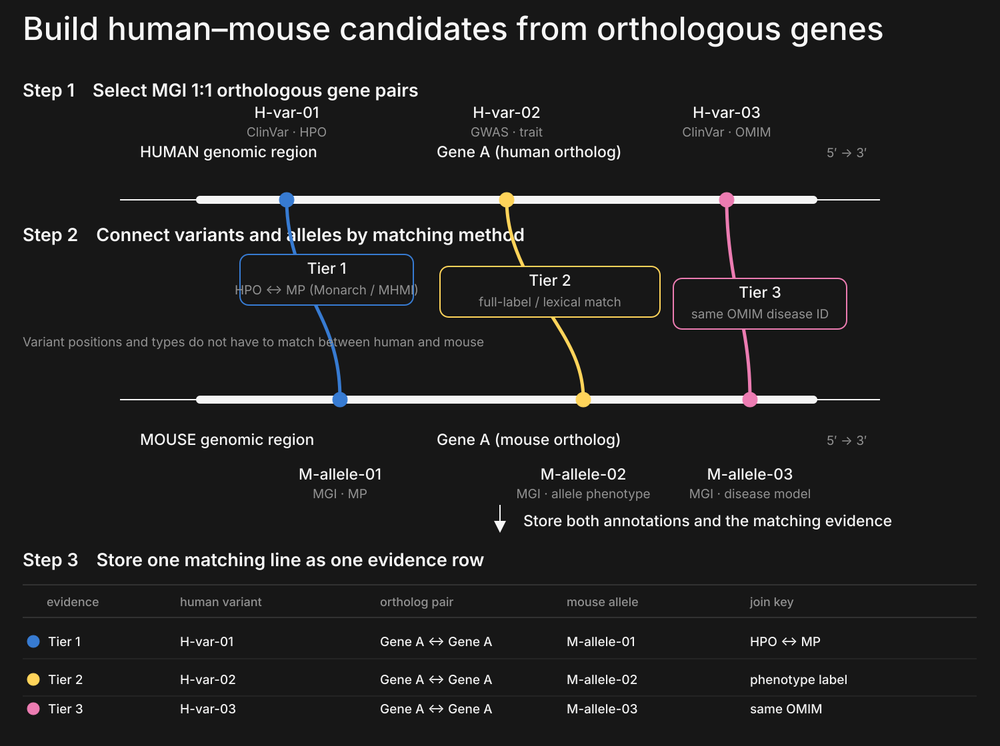
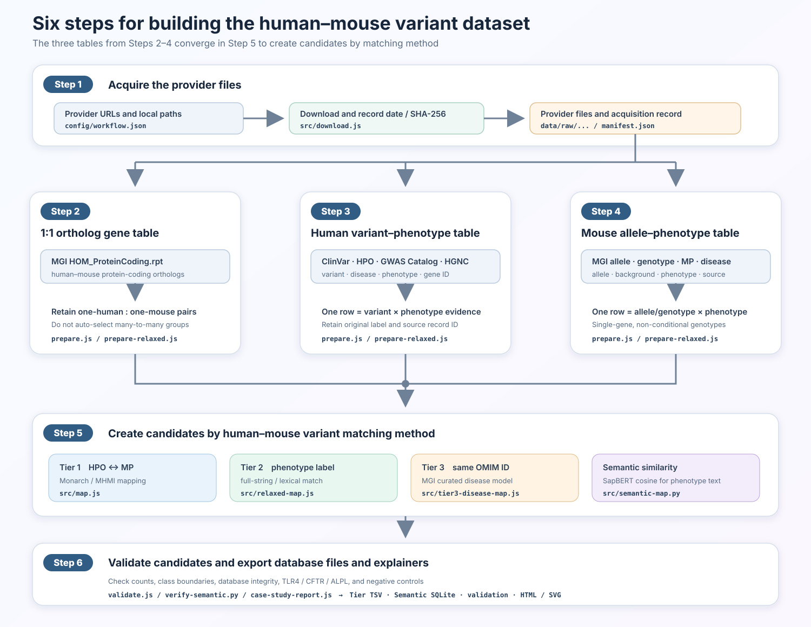

# Human–mouse variant correspondence: Methods and biological case studies

**Data snapshot:** source files downloaded 2026-09-11; semantic outputs regenerated 2026-09-24  
**Implementation:** `2026/` rebuild version 2.0.0  
**Objective:** represent human variants and mouse alleles through a shared 1:1 ortholog-gene anchor and independent phenotype, disease-model, semantic, and direct-correspondence evidence, without assuming identical genomic positions or identical amino-acid changes.

Japanese version: [`METHODS_AND_CASE_STUDIES.md`](METHODS_AND_CASE_STUDIES.md)

## 1. Design principle

The data model has two layers:

1. **Variant pair:** a human gene and variant paired with a mouse orthologous gene and allele/genotype.
2. **Connection evidence:** the route linking that pair, the evidence on both sides, an ontology predicate or shared disease identifier, a score/class or direct-match subtype, provenance, and review flags.

A pair is not forced into a single Tier. If HPO–MP, exact phenotype labels, a shared OMIM identifier, semantic similarity, or direct variant correspondence support the same pair, each route is retained as a separate evidence row. The interface can display the pair once and expand it to the original evidence records when needed.



Editable figure: [`output/tier_matching_strategy_en.svg`](output/tier_matching_strategy_en.svg). The previous [`output/methods_data_linkage.svg`](output/methods_data_linkage.svg) is retained separately.

## 2. Datasets used

`src/download.js` records the URL, provider-supplied modification date or release filename, actual download time, byte count, and SHA-256 for every downloaded data file in `data/raw/manifest.json`. SHA-256 is a content-derived identifier used to detect even a one-byte change on a later run. The table shows its first 12 characters; complete hashes and URLs are in [`DATA_VERSIONS.md`](DATA_VERSIONS.md).

| Dataset | File used | Role in this analysis | Server release marker | Downloaded (UTC) | SHA-256 prefix |
| --- | --- | --- | --- | --- | --- |
| ClinVar GRCh38 VCF | `data/raw/clinvar/clinvar.vcf.gz` | rsID, exact GRCh38 location, REF/ALT, condition, clinical significance | 2026-09-06 16:25:09 | 2026-09-11 05:06:43 | `8cff3c5fb9ba` |
| HPO disease annotations | `data/raw/hpo/phenotype.hpoa` | disease identifier to HPO phenotype | 2026-09-02 21:12:10 | 2026-09-11 05:06:46 | `e89aa39c8f97` |
| Monarch UPheno cross-species SSSOM | `data/raw/monarch/upheno-cross-species.sssom.tsv` | HPO–MP ontology mapping | 2026-09-09 14:51:58 | 2026-09-11 05:06:49 | `133b2ac088b2` |
| MHMI MGI mapping SSSOM | `data/raw/mhmi/mp_hp_mgi_all.sssom.tsv` | MGI-curated HPO–MP mapping | not reported | 2026-09-11 05:06:49 | `6b23131d80d5` |
| MGI GenePheno | `data/raw/mgi/MGI_GenePheno.rpt` | mouse genotype–MP evidence | 2026-09-07 12:01:12 | 2026-09-11 05:06:55 | `8defadf48934` |
| MGI HOM_ProteinCoding | `data/raw/mgi/HOM_ProteinCoding.rpt` | human–mouse 1:1 protein-coding orthologs | 2026-09-07 12:00:35 | 2026-09-11 05:06:57 | `14b81c2c8c65` |
| GWAS Catalog v1.0.2 | `data/raw/gwas/gwas_catalog_associations_v1.0.2.zip` | genome-wide significant human variant–trait evidence | `e116_r2026-09-04` | 2026-09-11 17:46:50 | `64f9f7c47daa` |
| MGI PhenotypicAllele | `data/raw/mgi/MGI_PhenotypicAllele.rpt` | allele name, type, original reference, synonym | 2026-09-07 12:01:57 | 2026-09-11 17:42:44 | `3fd8b25665b1` |
| MGI MP vocabulary | `data/raw/mgi/VOC_MammalianPhenotype.rpt` | MP label and definition | 2026-09-07 12:02:20 | 2026-09-11 17:42:47 | `2fd454098d42` |
| MGI Geno_DiseaseDO | `data/raw/mgi/MGI_Geno_DiseaseDO.rpt` | genotype–MP and curated disease model | 2026-09-07 12:01:13 | 2026-09-11 17:42:50 | `c4e5e3a05c68` |
| HGNC complete set | `data/raw/hgnc/hgnc_complete_set.txt` | GWAS Ensembl gene identifier to approved human gene | 2026-09-11 13:36:41 | 2026-09-11 17:46:57 | `9e07bb49393c` |

## 3. Semantic similarity: compare phenotype text with SapBERT

The query is phenotype text, not a variant coordinate. Human text is the `phenotype_label` from a ClinVar condition or significant GWAS trait. Mouse text is the `phenotype_label` representing an MGI MP label, allele name, or disease label. Texts are compared only within the same MGI 1:1 orthologous gene pair.

SapBERT converts each text into a 768-dimensional vector and the pipeline calculates cosine similarity. Each output row contains both texts, the score, class A–D, ortholog pair, variant/allele annotations, and direction-conflict or negation review flags. The model does not directly decide whether two variants are biologically equivalent.

| Item | Setting used here |
| --- | --- |
| Model | [SapBERT](https://aclanthology.org/2021.naacl-main.334/) / `cambridgeltl/SapBERT-from-PubMedBERT-fulltext` |
| Human query | ClinVar condition label or GWAS trait label with `P <= 5×10^-8` |
| Mouse comparison | MGI MP label, allele name, or disease label |
| Scope | Same MGI 1:1 orthologous gene pair only |
| Text representation | Pre-pooler CLS, 768 dimensions, maximum 128 tokens; longest observed input 68 tokens and zero truncations |
| Classes | A ≥ 0.8, B = 0.7–<0.8, C = 0.5–<0.7, D < 0.5; D is retained but excluded from default-use views |
| Outputs | `phenotype_pairs_class_A/B/C/D.tsv.gz`, variant/allele annotations, `correspondence.sqlite` |
| Model files used | revision `090663c3…51a4d`, model-weights SHA-256 `a4696930…25614`; see `data/models/sapbert/manifest.json` |

## 4. Six data-generation steps

“Make identifiers and columns consistent” does not mean overwriting a downloaded file. Provider files remain unchanged in `data/raw/`; separate analysis tables are written to `data/processed/`. The transformation converts forms such as `MIM:123456` to `OMIM:123456`, converts ontology URLs to `HP:...` or `MP:...`, and places gene IDs, variant/allele IDs, phenotypes, and source records in defined columns. Original phenotype labels and source record IDs remain available. This step does not convert ClinVar VCF coordinates or REF/ALT to a different assembly.



Editable figure: [`output/data_generation_workflow_en.svg`](output/data_generation_workflow_en.svg)

| Step | Exact operation | Main inputs | Executable scripts | Main outputs |
| --- | --- | --- | --- | --- |
| 1 | Download the provider files and record URL, provider date/release, acquisition time, size, and SHA-256 | `data_sources` in `config/workflow.json` | `src/download.js` | `data/raw/...`, `data/raw/manifest.json`, `DATA_VERSIONS.md` |
| 2 | Extract MGI clusters containing exactly one human and one mouse gene; never auto-select an ambiguous many-to-many link | `data/raw/mgi/HOM_ProteinCoding.rpt` | `src/prepare.js`, `src/prepare-relaxed.js` | `ortholog_mapping.tsv`, `ortholog_mapping_enriched.tsv` |
| 3 | Make one human row per variant × phenotype evidence record; use consistent disease-ID forms, join ClinVar conditions to HPO by shared ID, and restrict GWAS to `P <= 5×10^-8` with direct `SNP_GENE_IDS` | ClinVar, HPO, GWAS Catalog, HGNC | `src/prepare.js`, `src/prepare-relaxed.js` | `human_variant_hpo.tsv.gz`, `human_variant_phenotypes.tsv.gz` |
| 4 | Make one mouse row per allele/genotype × phenotype evidence record; require a single-gene non-conditional genotype and retain allele, MP, background, and PubMed IDs | MGI GenePheno, PhenotypicAllele, MP vocabulary | `src/prepare.js`, `src/prepare-relaxed.js` | `mouse_allele_mp.tsv`, `mouse_variant_phenotypes.tsv.gz` |
| 5 | Within the same 1:1 ortholog only, calculate HPO–MP, phenotype-label, shared-OMIM, and SapBERT-text routes independently | outputs from stages 2–4 | `src/map.js`, `src/relaxed-map.js`, `src/tier3-disease-map.js`, `src/semantic-map.py` | Tier 1/2/3 TSVs and Semantic A/B/C/D TSVs/SQLite |
| 6 | Check row counts, thresholds, database integrity, TLR4/CFTR/ALPL, and negative controls; update summaries and explainers | stage-5 results and `data/controls/*.tsv` | `src/validate.js`, `src/verify-semantic.py`, `src/case-study-report.js` | validation TSV/JSON, case-study summary, HTML, SVG |

Stage 2 **limits each human–mouse comparison to a gene pair that MGI reports as a 1:1 ortholog**. The current data produced 16,536 non-duplicate gene pairs from 16,537 MGI rows; 11,836 pairs had phenotype evidence in both species and entered Semantic comparison.

Stage 3 does not propagate a gene-level condition to every variant in that gene. A ClinVar variant condition connects to an HPO disease annotation only when their disease identifiers agree. HPO is restricted to aspect `P`, negated (`NOT`) annotations are excluded, and example-specific literature phenotypes are excluded from production input.

Stage 4 and Tier 3 use only MGI-curated genotype–disease models and never infer an OMIM identifier from a similar disease name.

## 5. Classification by human–mouse variant matching method

Tier numbers name query strategies; they are not a universal confidence ranking.

| Route | Connection rule | Current rows | Interpretation |
| --- | --- | ---: | --- |
| Tier 1 | ClinVar condition → HPO → Monarch/UPheno or MHMI HPO–MP → MGI allele, within a 1:1 ortholog | 1,089,740 | Cross-species phenotype bridge retaining the ontology predicate |
| Tier 2 | Restrict to a 1:1 ortholog first, then compare ClinVar/GWAS phenotype evidence with MGI MP labels or allele names | 76,619 | Support B is a full-string match after lowercasing, punctuation removal, and the documented alias substitutions; C is an informative-token hypothesis requiring review |
| Tier 3 | Exact OMIM identifier shared by a ClinVar condition and an MGI-curated disease model, within a 1:1 ortholog | 331,245 | Disease-model evidence independent of the ontology bridge |
| Semantic | Compare human and mouse phenotype text within a 1:1 ortholog gene using SapBERT | A 1,702; B 4,412; C 66,367; D 2,836,628 | A/B/C are routine candidates; D is retained for audit and excluded from the default view |

Tier 1 retains the SSSOM predicate, mapping confidence, justification, mapping date, and source. Accepted predicates are `skos:exactMatch`, `closeMatch`, `broadMatch`, and `narrowMatch`, with confidence at least 0.8.

Tier 2 support B requires full-string identity after lowercasing, replacing punctuation with spaces, and applying a small code-defined alias list such as `LPS`/`endotoxin` to `lipopolysaccharide`. Support C requires at least two shared tokens after generic words are removed and Jaccard similarity of at least 0.6. Former support A was retired because it depended on manually curated literature phenotypes.

Tier 3 requires exact OMIM-identifier identity.

Semantic classes are based on cosine similarity: A=`0.8–1.0`, B=`0.7–<0.8`, C=`0.5–<0.7`, and D=`<0.5`. All A/B text pairs above threshold are retained; for C/D, only the top 20 mouse texts per human text within the ortholog are stored. D has `eligible_for_default_use=0`. Opposite direction, negation, and truncation are stored as review flags without changing the cosine class.

## 6. Database structure and provenance

Current outputs comprise three independent Tier 1/2/3 gzip TSV files and the semantic SQLite database `output/semantic/correspondence.sqlite`.

The main semantic SQLite tables are `ortholog`, `phenotype_text`, `human_annotation`, `mouse_annotation`, `phenotype_match`, and `metadata`. Routine queries use `active_phenotype_pairs` and `active_variant_correspondence`, which return A/B/C; audit queries can use `phenotype_pairs` and `variant_correspondence` to include D.

For the integrated database, `variant_pair` should uniquely represent the human variant, mouse allele/genotype, and ortholog pair. `connection_evidence` should contain multiple matching-method-specific rows. Tier 1/2/3 contribute ontology predicates, exact labels, or shared OMIM identifiers; Semantic contributes the cosine score and class. Original phenotype and source records are not collapsed. See [`database/schema.sql`](database/schema.sql) and [`database/README.md`](database/README.md).

For example, CFTR contributes one `variant_pair` row for “CFTR / rs113993960 ↔ Cftr / MGI:1856709.” `connection_evidence` then contains a Tier 1 row linking HP:0001508 to MP:0001732 through `skos:narrowMatch` and a separate Tier 3 row recording shared OMIM:219700.

## 7. Biological case studies

These three examples are positive-control case studies of whether pre-specified pairs can be retrieved through different matching methods. They are not an independent benchmark for overall model accuracy.

### 7.1 TLR4: the same LPS pathway, but different positions and domains

**Human:** rs4986790 is GRCh38 chr9:117,713,024 A>G, ClinVar Variation ID 6660, and `p.Asp299Gly`. Asp299 is in the extracellular domain of TLR4. Arbour et al. reported reduced response to inhaled LPS in carriers of Asp299Gly/Thr399Ile, and Figueroa et al. reported impaired MyD88/TRIF recruitment. Functional effects have not been reproduced uniformly across populations and assays, and the aggregate classification in the downloaded ClinVar VCF is `Benign`. This is therefore a reported LPS-response functional example, not a pathogenic-variant claim.

**Mouse:** the spontaneous C3H/HeJ allele `Tlr4<Lps-d>` (MGI:1857718) is `p.Pro712His`. Pro712 lies in the cytoplasmic TIR domain; the allele impairs LPS signal transduction and causes endotoxin hyporesponsiveness.

**Structural interpretation:** human D299G is extracellular, whereas mouse P712H is in the intracellular TIR domain. They are neither the same residue nor the same domain. They nevertheless perturb different points in the same TLR4 signaling axis and correspond at the level of LPS response. This is the clearest motivation for searching functional correspondence rather than variant identity alone.

**Retrieval in this database:** Tier 1/2/3 returned zero rows. Without injecting a manual human LPS phenotype, one semantic class C row (cosine 0.548) linked a downloaded GWAS composite chronic-inflammatory-disease label to MGI `increased susceptibility to induced arthritis`. This is a loose review candidate, not evidence that the LPS mechanism was reproduced.

Key sources: [ClinVar 6660](https://www.ncbi.nlm.nih.gov/clinvar/variation/6660/), [Arbour et al., 2000, PMID 10835634](https://pubmed.ncbi.nlm.nih.gov/10835634/), [Figueroa et al., 2012, PMID 22474023](https://pubmed.ncbi.nlm.nih.gov/22474023/), [Netea et al., 2005, PMID 15927851](https://pubmed.ncbi.nlm.nih.gov/15927851/), [Poltorak et al., 1998, PMID 9851930](https://pubmed.ncbi.nlm.nih.gov/9851930/), [Qureshi et al., 1999, PMID 9989976](https://pubmed.ncbi.nlm.nih.gov/9989976/), and [MGI:1857718](https://www.informatics.jax.org/allele/MGI:1857718). The original explainer is [`../TogoVar_MoGplus.pdf`](../TogoVar_MoGplus.pdf).

### 7.2 CFTR: linking a human in-frame deletion to a mouse null allele

**Human:** rs113993960 is the left-normalized GRCh38 representation chr7:117,559,590 ATCT>A, ClinVar Variation ID 7105, `NM_000492.4:c.1521_1523delCTT`, `p.Phe508del`. Phe508 lies at the surface of nucleotide-binding domain 1 (NBD1) and contributes to its interface with intracellular loop 4 (ICL4). F508del perturbs both NBD1 energetics and the NBD1–ICL4 interface, affecting folding, trafficking, and channel gating.

**Mouse:** `Cftr<tm1Unc>` (MGI:1856709) is a targeted `p.S489*` null allele. It is not an F508del knock-in; a stop codon was introduced in exon 10. Homozygotes show failure to thrive, intestinal obstruction, and gland pathology overlapping human cystic fibrosis.

**Structural interpretation:** a one-residue NBD1 deletion and an upstream premature stop differ in variant class and molecular position, but both reduce CFTR function. Phenotype ontology and a curated disease model are therefore the principal connection evidence.

**Retrieval in this database:** Tier 1 returned six evidence rows; Tier 3 returned two rows sharing OMIM:219700. A representative bridge is human `Failure to thrive` (HP:0001508) to mouse `postnatal growth retardation` (MP:0001732) through `skos:narrowMatch`. The highest semantic candidate concerns a different sperm phenotype and is not used as the main cystic-fibrosis evidence.

Key sources: [ClinVar 7105](https://www.ncbi.nlm.nih.gov/clinvar/variation/7105/), [Rabeh et al., 2012, PMID 22265408](https://pubmed.ncbi.nlm.nih.gov/22265408/), [Snouwaert et al., 1992, PMID 1380723](https://pubmed.ncbi.nlm.nih.gov/1380723/), and [MGI:1856709](https://www.informatics.jax.org/allele/MGI:1856709).

### 7.3 ALPL: linking a human frameshift to a mouse splice-site hypomorph

**Human:** rs1558543066 is left-normalized as GRCh38 chr1:21,554,098 TA>T in the VCF and represented as `NC_000001.11:g.21554099del`, `NM_000478.6:c.18del`, `p.Val7fs` in HGVS. It is ClinVar Variation ID 518424, classified `Pathogenic` in the downloaded VCF and associated with hypophosphatasia. The frameshift occurs near the start of the coding sequence and is consistent with loss of normal TNSALP protein.

**Mouse:** the ENU allele `Alpl<Hpp>` (MGI:3051587; former gene name *Akp2*) is `c.862+5G>A` at a splice donor. Residual normal splicing makes it hypomorphic. The abnormal transcript introduces a premature stop and a 276-aa truncated protein lacking part of the conserved active-site architecture present in the 525-aa wild-type protein. Homozygotes show late-onset mineralization defects, and MGI curates the genotype as an adult hypophosphatasia model (OMIM:146300).

**Structural interpretation:** the human N-terminal frameshift and mouse intron-8 splice-site hypomorph differ in position, variant class, and residual activity, but both converge on reduced TNSALP activity and hypophosphatasia.

**Retrieval in this database:** Tier 1 did not retrieve the specified allele. Tier 2 returned 20 rows through the exact normalized label `hypophosphatasia`, and Tier 3 returned two rows sharing OMIM:146300. Semantic candidates also include the same phrase, but the exact label and curated disease model are the primary evidence.

Key sources: [ClinVar 518424](https://www.ncbi.nlm.nih.gov/clinvar/variation/518424/), [Hough et al., 2007, PMID 17539739](https://pubmed.ncbi.nlm.nih.gov/17539739/), [MGI:3051587](https://www.informatics.jax.org/allele/MGI:3051587), and [MGI genotype MGI:3722925](https://www.informatics.jax.org/allele/genoview/MGI:3722925).

## 8. Why the three cases require different matching methods

| Case | Human variant structure | Mouse variant structure | Main route | Why a different matching method is needed |
| --- | --- | --- | --- | --- |
| TLR4 | extracellular p.Asp299Gly | TIR-domain p.Pro712His | ortholog + Semantic C | Structured HPO–MP/OMIM routes miss the pair and the positions differ; retain only as an exploratory candidate |
| CFTR | NBD1 p.Phe508del | p.S489* null | Tier 1 + Tier 3 | Variant classes differ, but ontology phenotypes and the cystic-fibrosis disease model agree |
| ALPL | p.Val7fs | c.862+5G>A splice hypomorph | Tier 2 + Tier 3 | HPO–MP misses the selected allele, whereas the phenotype label and hypophosphatasia model recover it |

These examples show that a single cross-species mapping can miss useful variant pairs and that the database must preserve what matched in each route. Because the cases were pre-selected positive controls, they do not estimate overall precision, recall, or clinical validity.

## 9. Validation and limitations

- Integrated route queries retrieved all three specified pairs (3/3), and all nine case-by-Tier expectations passed.
- Two negative controls passed: one prevents links between non-orthologous genes and one prevents claims that the human and mouse changes are at the same residue.
- Semantic classes A/B/C/D are not calibrated confidence probabilities. They should be treated only as candidate priorities until evaluated on independent positives, opposite-direction pairs, different-organ pairs, and unrelated pairs.
- Cosine similarity does not fully resolve negation, increased versus decreased direction, stimulus, organ, or the distinction between a disease and a quantitative trait. The absence of a review flag is not proof of equivalence.
- ClinVar classification aggregates variant–condition submissions and is not the same as a functional effect reported in a paper. A functional report and a benign aggregate classification can coexist, as in the TLR4 example.
- Mouse phenotypes depend on genetic background, zygosity, and experimental conditions. Convergence on gene function does not imply the same magnitude, direction, or mechanism in both species.
- Some source data, including OMIM-derived HPO annotations, may have redistribution restrictions. Terms must be checked before releasing a public database.

## 10. Reproduction

All stages read the single `config/workflow.json` file and are executed in a fixed order by `run.sh`. Data URLs, local filenames, inclusion rules, and thresholds are changed in that file. A provider-side change to the column layout or compression format also requires an update to the corresponding parser and its tests.

```bash
cd 2026
./run.sh
```

Inspect every stage and script without executing anything:

```bash
./run.sh --dry-run
```

Use `--skip-download` to reuse current files in `data/raw/`, `--force-download` to retrieve every provider file again, or `--skip-semantic` to omit the SapBERT steps. The semantic steps use the Python 3.12 `.venv-semantic` environment and verify the selected model revision and SHA-256 before computation.

Machine-readable current summaries are in [`output/semantic/summary.json`](output/semantic/summary.json) and [`output/semantic/case_study_summary.tsv`](output/semantic/case_study_summary.tsv). Explanatory figures are in [`output/tier_evidence_explainer.html`](output/tier_evidence_explainer.html), [`output/case_study_evidence_explainer.html`](output/case_study_evidence_explainer.html), and the English [`output/methods_and_biological_evidence_en.html`](output/methods_and_biological_evidence_en.html) / Japanese [`output/methods_and_biological_evidence.html`](output/methods_and_biological_evidence.html) Methods pages.
